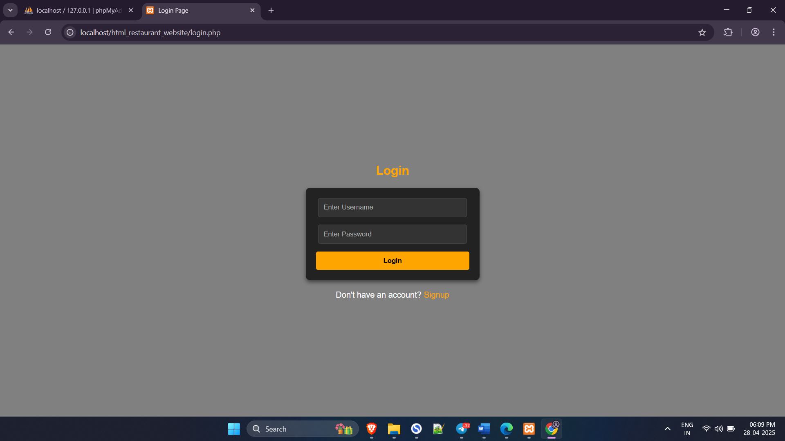
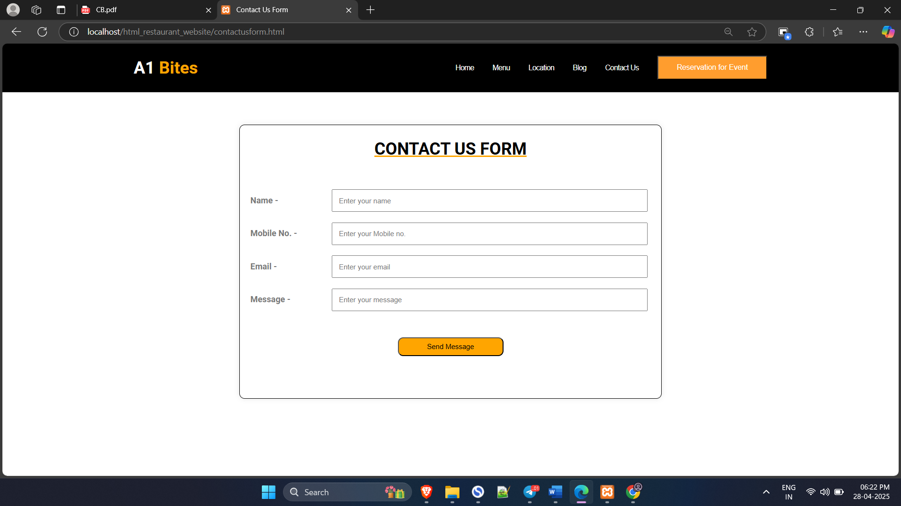
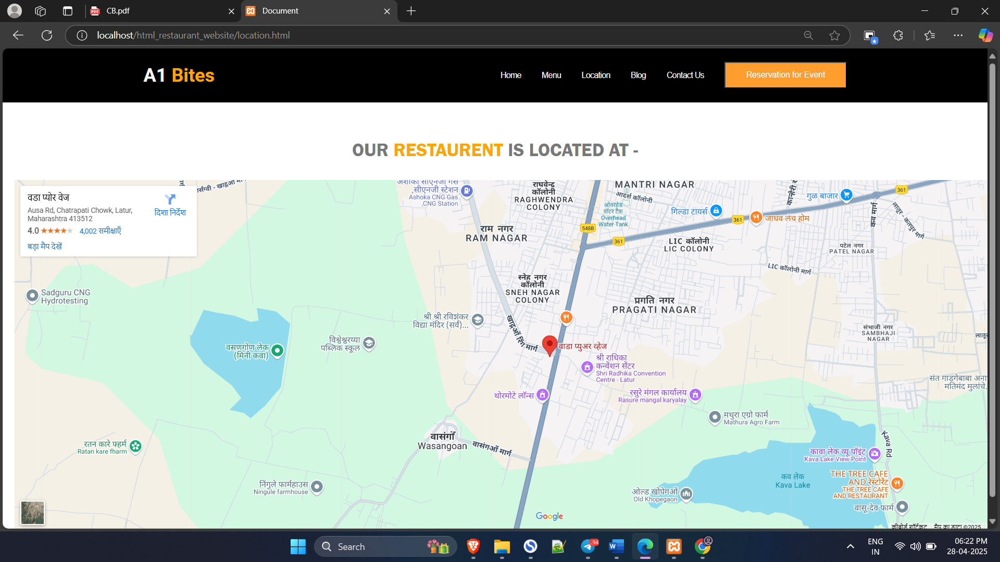
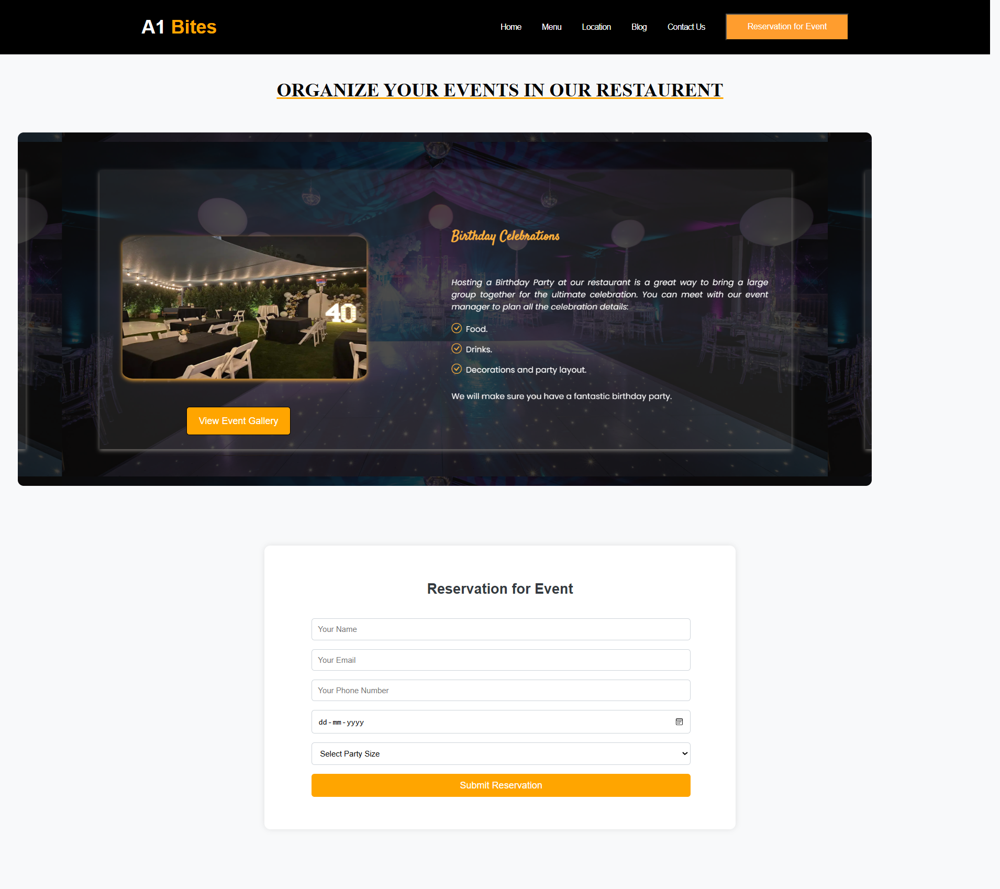
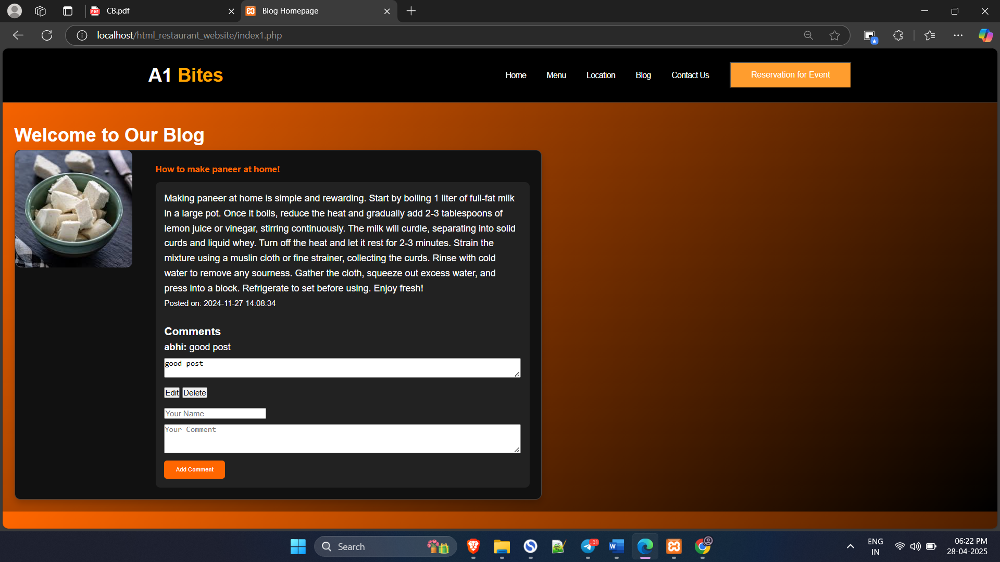

# The restaurant management project that I made in my 5th semester as a part of academics.

This project is useful for restaurant owners for marketing or promoting their restaurant or hotel.

## Features

- restaurant owner can make changes in the menu i.e. add, remove and modify any dish or their prices directly from database.
- Display location of the restaurant using google map.
- Blog page where restaurant owner can share blogs which can be read by any user. users can also comment on the blogs which will be visible in databse.
- Contact us page
- Reservation page where users can fill the form and book the table/s for specific date

## Screenshots

### LOGIN/REGISTER PAGE

### HOMEPAGE

### MENU PAGE

### CONTACT US PAGE

### LOCATION PAGE

### RESERVATION PAGE

### BLOG PAGE

